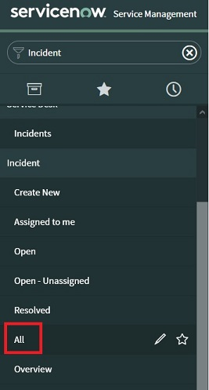

In this section we describe the configuration of Incident Similarity for Watson AIOps AI Manager on IBM RedHat OpenShift Kubernetes Service (ROKS). 
This document was written based on our experience configuring Incident Similarity for AI Manager v2.0 on Red Hat OpenShift 4.3 running on x86 architecture.

## Exporting Incidents from ServiceNow

This section will describe how to manually export incident data from ServiceNow.

Log in to ServiceNow and using the **Filter Navigator** search for **Incidents**. Select **All** under **Incident** to bring up a list of all the incidents.



Filter the list to include only records where `State` is `Closed`. Incidents records where `State` is `Resolved` are skipped/discarded by AI Manager consumption process. If you want to include resolved incidents, you can include them in the filter here, but you will need to massage the records and set the `state` field to `Closed` before loading them in to AI Manager.

Keep in mind that most ServiceNow instances will put an upper limit on the number of records that can be exported through the UI (e.g. 10000). If the number of records you want to export are greater than this upper bound, you can filter the list according to date in order to reduce the number of records. You can then export them in chunks that stay under the record limit. For example, first export is incident records from current year, second export is incidents from previous year, etc.

Click the cog wheel to personalize the list columns. Include the following columns, if not already included.

| Column    |
|:--------------|
|Number|
|Opened|
|Short Description|
|Priority|
|State|
|Updated|
|Business duration|
|Closed|
|Resolved|
|Created|
|Description|
|Parent Incident|
|Problem|
|Resolution notes|
|Severity|
|Impact|
|Configuration Item|
|Comments and Work notes|

To export the records, right click on any column heading, go to **Export** and select **CSV**. You must select **CSV** as the export format, as it's the only format that reserves all the comments. After the export is complete, click **Download** to download the exported records in CSV format.

## Converting to JSON

The next step is to take the downloaded CSV file(s) from ServiceNow and convert them to "JSON Lines" format for uploading to AI Manager.

A Python script is provided here to assist in conversion from CSV to JSONL. **Note, that this script is a beta helper script and will most likely need customized to your environment.**

The script requires Python be installed on your workstation.

Download [incidents.py](./scripts/incidents.py) and rename the source CSV file to **incidents.csv** placing it in the same directory.

Run the following to generate JSON lines formatted output.

```
python incident.py > incidents.json
```

`incidents.json` is the JSON lines formatted file with properly formatted fields for consumption in AI manager.

## Copy JSON file to Minio

The next step is to copy the file to Minio.

Compress via gzip the file before copying to the model-train console so that the transfer will be quicker. Call the file `incidents.json.gz`. Copy the file to the model-train console.

```
oc cp incidents.json.gz $(oc get pods -l app.kubernetes.io/component=model-train-console -o jsonpath='{ .items[*].metadata.name }'):/home/zeno/
```

Log in to the model-train console.

```
oc exec -it $(oc get pods -l app.kubernetes.io/component=model-train-console -o jsonpath='{ .items[*].metadata.name }') -- bash
```

Once logged in to the model-train console, decompress the JSON file.

```
gunzip incidents.json.gz
```

Copy incidents.json file to Minio.

```
aws s3 cp incidents.json s3://bucket/incidents.json
```

## Train the similar incidents model

Go to the UI and drill down to the target application. On the Insight Models tab, click the edit button for Similar incidents.

On step 4, enter `s3://bucket/incidents.json` and click `Generate scripts`.

Step 5 is not clear, but you need to copy incident file from s3://bucket/ to the proper bucket for the application. For instance, if the location shown is `s3://$SIMILAR_INCIDENTS/ghgjy5um/71cyvyal`, then run the following command from the model-train console.

```
aws s3 cp s3://bucket/incidents.json s3://$SIMILAR_INCIDENTS/ghgjy5um/71cyvyal
```

From the model-train console, follow steps 6 and 7 to run the model training. Using the same group and application from the example above, run the following commands.

```
cd /home/zeno/incident/
bash index_incidents.sh s3://bucket/incidents.json ghgjy5um 71cyvyal
```

## Verify model

Run the following command inside of the model-train console to verify that the model was trained and is inside ElasticSearch database.

```
curl -s -u $ES_USERNAME:$ES_PASSWORD -XGET $ES_URL/_cat/indices --insecure | grep normalized-incidents_group_
```

Congratulations, you have configured incident similarity for AI Manager!

